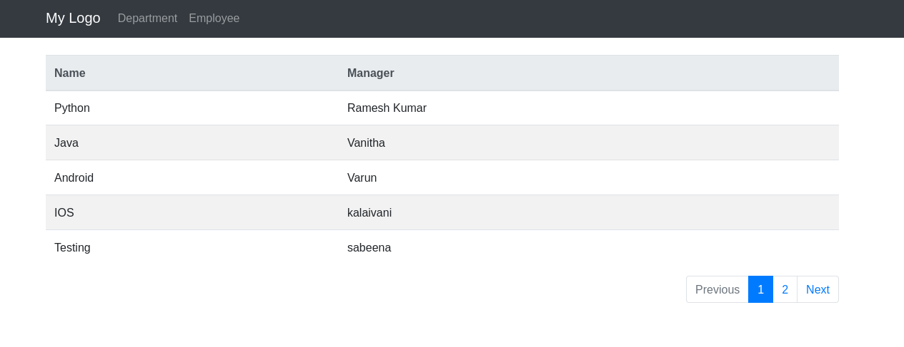
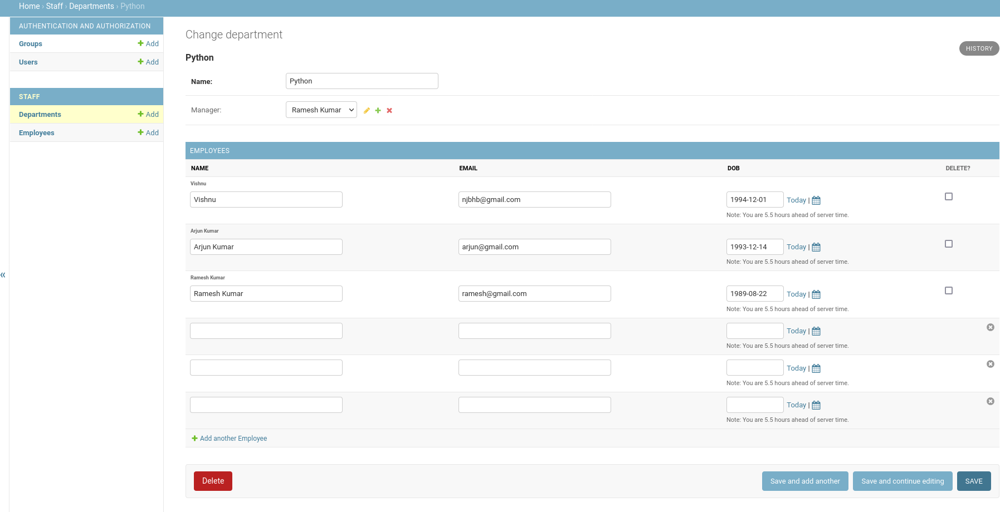

Django application with department and employee relation
with pre-loaded data

Installation
```bash
# Create sqlite database
python3 manage.py makemigrations staff
python3 manage.py migrate

# Insert pre-loaded data
python3 manage.py loaddata staff_data.json

# Create a super user for admin login
python3 manage.py createsuperuser
```


